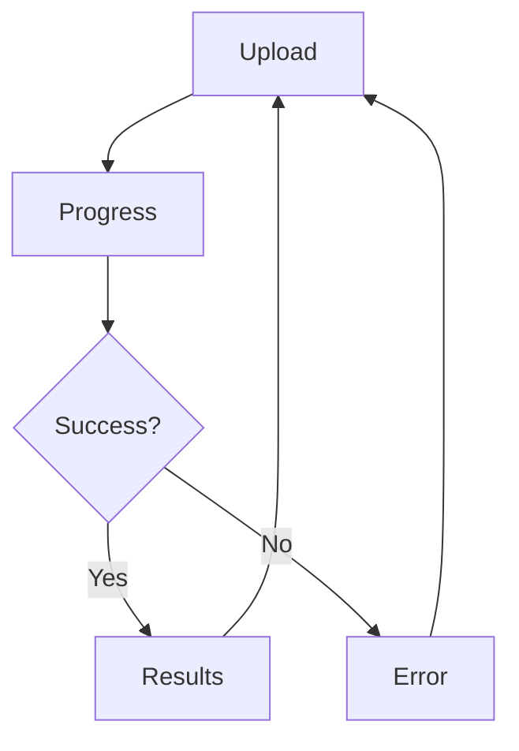

# 🎨 Invoice Parser - Frontend Documentation

## Обзор

Современный, красивый веб-интерфейс для AI-powered парсера документов, созданный с использованием Vanilla JavaScript, CSS3 и HTML5.

---

## 📁 Структура файлов

```
static/
├── index.html                  # Главная страница
├── style.css                   # Стили (градиенты, анимации)
├── script.js                   # Логика приложения
├── favicon.svg                 # Иконка сайта
├── integration-example.html    # Примеры интеграции
└── README.md                   # Документация интерфейса
```

---

## 🎯 Основные компоненты

### 1. **Форма загрузки**
```
┌─────────────────────────────┐
│   📤 Загрузите документ     │
│                             │
│   ┌───────────────────┐    │
│   │ Drag & Drop Zone  │    │
│   │   или выбор файла │    │
│   └───────────────────┘    │
│                             │
│   [Распознать документ]     │
└─────────────────────────────┘
```

**Возможности:**
- Drag & Drop загрузка
- Выбор через диалог
- Валидация формата и размера
- Предпросмотр информации о файле

### 2. **Индикатор прогресса**
```
┌─────────────────────────────┐
│      ⚙️ Обработка...        │
│                             │
│   ████████░░░░░░░░░  45%   │
│                             │
│  AI анализирует документ    │
└─────────────────────────────┘
```

**Возможности:**
- Анимированный спиннер
- Процент выполнения
- Статус операции

### 3. **Отображение результатов**
```
┌─────────────────────────────┐
│ ✅ Результаты парсинга      │
├─────────────────────────────┤
│ 📋 Информация о документе   │
│   Номер: INV-001            │
│   Дата: 2024-01-15          │
│   Поставщик: Company A      │
├─────────────────────────────┤
│ 📊 Товары и услуги          │
│   Таблица с позициями       │
├─────────────────────────────┤
│ 💰 Итого                    │
│   Сумма: $1,200.00          │
└─────────────────────────────┘
```

**Возможности:**
- Структурированное отображение
- Таблица товаров
- Итоговые суммы
- RAW JSON для разработчиков
- Экспорт в JSON
- Копирование в буфер

---

## 🎨 Дизайн

### Цветовая палитра

```css
--primary-color: #6366f1      /* Индиго */
--secondary-color: #10b981     /* Зелёный */
--danger-color: #ef4444        /* Красный */
--background: linear-gradient(135deg, #667eea 0%, #764ba2 100%)
```

### Типографика

- **Основной шрифт**: Inter, San Francisco, Segoe UI
- **Моноширинный**: Courier New (для JSON)

### Анимации

- ✨ Fade In/Out
- 📈 Slide Up/Down
- 🔄 Spinner rotation
- 🎭 Smooth transitions
- 📊 Progress bar animation

---

## 🔧 Технические детали

### JavaScript Features

- **ES6+ синтаксис**: async/await, destructuring, arrow functions
- **Fetch API**: для HTTP запросов
- **LocalStorage**: хранение токена
- **FormData**: для загрузки файлов
- **Event Listeners**: обработка UI событий

### CSS Features

- **CSS Variables**: для легкой кастомизации
- **Flexbox & Grid**: для адаптивной вёрстки
- **Animations**: keyframes и transitions
- **Media Queries**: адаптивность
- **Modern selectors**: :hover, :focus, :disabled

### Browser Support

| Browser | Version |
|---------|---------|
| Chrome | 90+ |
| Firefox | 88+ |
| Safari | 14+ |
| Edge | 90+ |

---

## 📱 Адаптивность

### Breakpoints

```css
@media (max-width: 768px) {
  /* Mobile styles */
}

@media (min-width: 769px) and (max-width: 1024px) {
  /* Tablet styles */
}

@media (min-width: 1025px) {
  /* Desktop styles */
}
```

### Mobile оптимизации

- Увеличенные touch targets
- Вертикальный layout
- Упрощённая навигация
- Оптимизированные размеры шрифтов

---

## 🔐 Безопасность

### Реализованные меры

1. **Authorization Token**
   - Хранится в localStorage
   - Передаётся в Bearer token
   - Настраивается пользователем

2. **Input Validation**
   - Проверка типа файла
   - Ограничение размера (50MB)
   - Sanitization данных

3. **Error Handling**
   - Graceful degradation
   - Понятные сообщения об ошибках
   - Retry механизм

---

## 🚀 API Интеграция

### Endpoints

```javascript
// Parse document
POST /parse
Headers: Authorization: Bearer {token}
Body: FormData with 'file'

// Health check
GET /health

// Root (Web interface)
GET /
```

### Response Format

```json
{
  "success": true,
  "data": {
    "invoice_number": "...",
    "invoice_date": "...",
    "items": [...],
    "total_amount": 0.00
  },
  "processed_at": "2024-01-15T10:30:00"
}
```

---

## 🎓 Примеры использования

### Загрузка файла

```javascript
const fileInput = document.querySelector('#fileInput');
fileInput.addEventListener('change', async (e) => {
  const file = e.target.files[0];
  await parseDocument(file);
});
```

### Обработка результатов

```javascript
function displayResults(data) {
  // Header info
  displayHeaderInfo(data.data);

  // Items table
  displayItemsTable(data.data.items);

  // Summary
  displaySummary(data.data);
}
```

### Экспорт JSON

```javascript
function downloadJson() {
  const dataStr = JSON.stringify(parsedData, null, 2);
  const blob = new Blob([dataStr], { type: 'application/json' });
  const url = URL.createObjectURL(blob);
  const a = document.createElement('a');
  a.href = url;
  a.download = `invoice_${Date.now()}.json`;
  a.click();
}
```

---

## 🔄 Состояния приложения



### State Management

```javascript
const state = {
  selectedFile: null,
  authToken: '',
  parsedData: null
};
```

---

## 📦 Зависимости

### External

- **Font Awesome 6.4** - иконки
- **Google Fonts (опционально)** - шрифты

### Internal

- Нет внешних JavaScript библиотек
- Vanilla JS для максимальной производительности

---

## 🎯 UX Features

### Feedback

- 🎉 Success messages
- ⚠️ Error notifications
- 📊 Progress indicators
- ✅ Confirmation toasts

### Keyboard Shortcuts

- `ESC` - закрыть модальное окно
- `Enter` - сохранить настройки (в модалке)

### Loading States

- Disabled кнопки во время загрузки
- Spinner анимация
- Процент выполнения

---

## 🔧 Кастомизация

### Изменение цветов

Отредактируйте CSS переменные в `style.css`:

```css
:root {
  --primary-color: #6366f1;
  --secondary-color: #10b981;
  /* ... */
}
```

### Изменение текстов

Все тексты находятся в `index.html` и легко редактируются.

### Добавление новых полей

1. Обновите `displayHeaderInfo()` в `script.js`
2. Добавьте поля в массив `fields`
3. Стили применятся автоматически

---

## 📊 Performance

### Оптимизации

- Минимальные зависимости
- CSS анимации через transform
- Debouncing для событий
- Lazy loading изображений
- Оптимизированные селекторы

### Метрики

- **First Paint**: < 1s
- **Time to Interactive**: < 2s
- **Bundle Size**: ~15KB (без Font Awesome)

---

## 🧪 Тестирование

### Ручное тестирование

1. Загрузка различных форматов
2. Drag & Drop функциональность
3. Валидация ошибок
4. Адаптивность на разных устройствах
5. Keyboard navigation

### Проверка совместимости

```bash
# Запустите на разных браузерах
- Chrome DevTools Device Mode
- Firefox Responsive Design Mode
- Safari Web Inspector
- Real devices testing
```

---

## 🐛 Known Issues

*Пока нет известных проблем*

---

## 🚀 Будущие улучшения

- [ ] Темная/светлая тема
- [ ] Multi-language support
- [ ] Batch upload
- [ ] Export в Excel
- [ ] History просмотренных документов
- [ ] Websocket для real-time прогресса
- [ ] PWA support
- [ ] Offline mode

---

## 📞 Поддержка

Для вопросов и багов:
1. Проверьте [README.md](static/README.md)
2. Посмотрите [integration-example.html](static/integration-example.html)
3. Проверьте логи браузера (F12)
4. Проверьте логи сервера

---

## 📄 Лицензия

Proprietary - все права защищены

---

**Создано с ❤️ для удобного парсинга документов**

